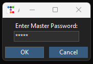
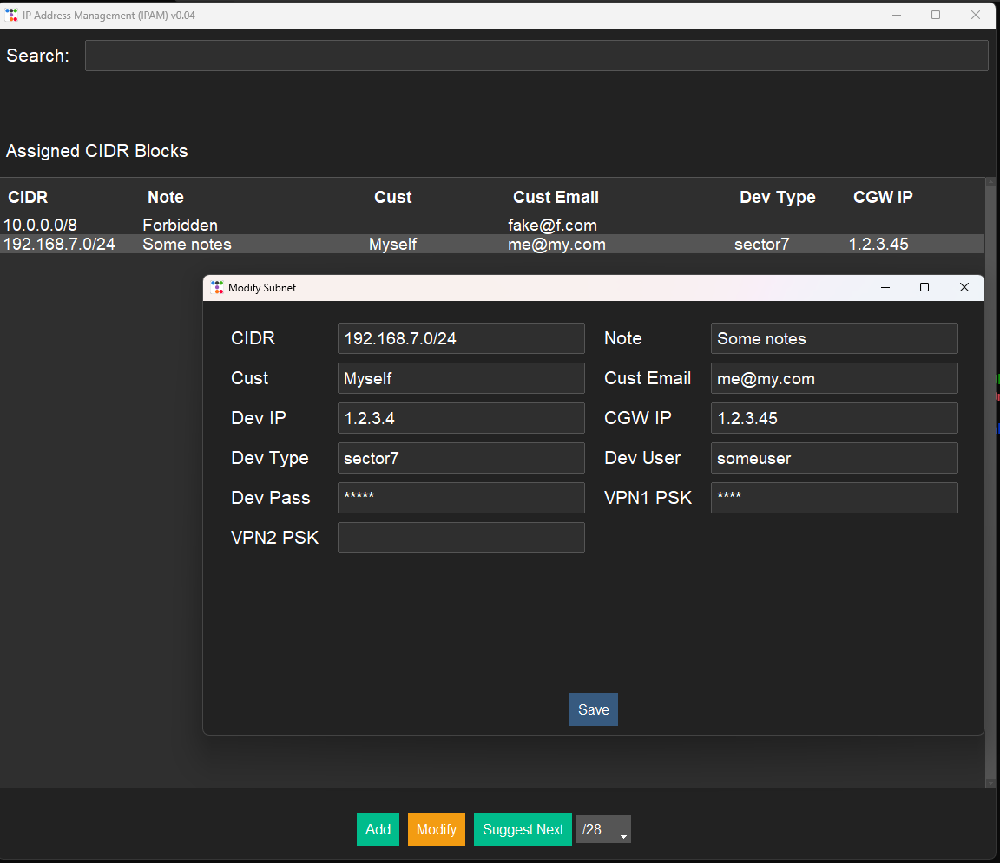
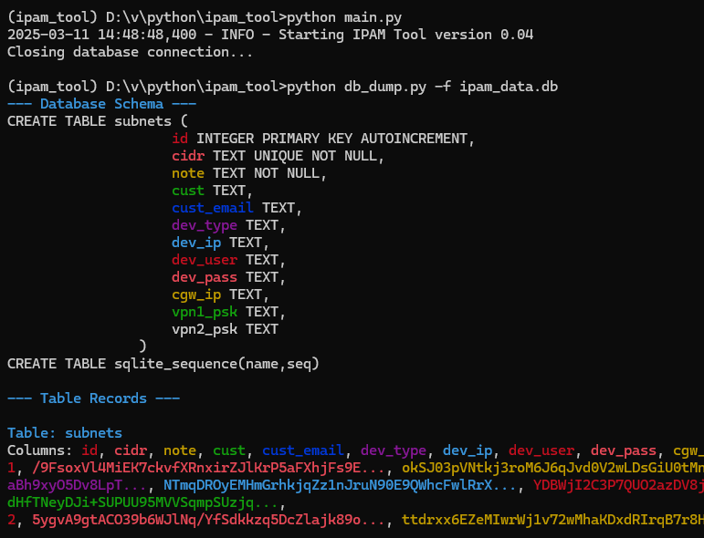
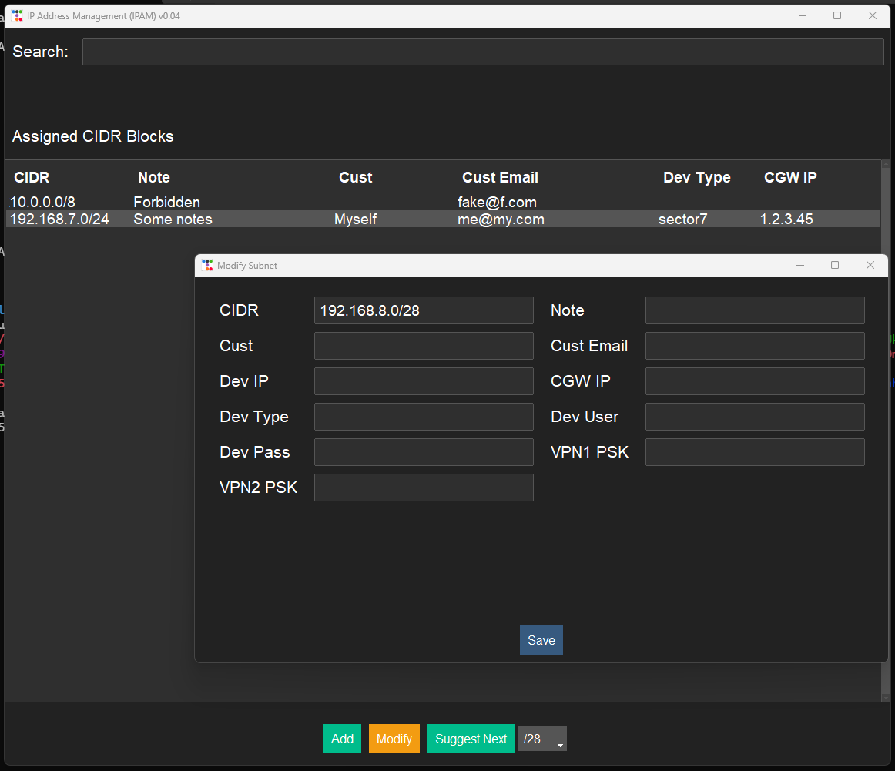

# IP Address Management (IPAM) Tool

A Python-based IP Address Management system for tracking and managing private network subnets. 

This application provides a user-friendly GUI interface for managing IP address assignments across Class A, B, and C private networks.

There are a few secret fields that I needed, and AWS secrets format export I wanted.   

## Screen Shots






## Features

- Manage private subnets (Class A, B, C)
- Track additional notes for each subnet
- Divide subnets into configurable CIDR blocks (up to /30)
- Quick search functionality for both CIDR and notes
- Real-time subnet availability checking
- Automatic next subnet suggestion
- Dark mode interface using ttkbootstrap
- SQLite database for persistent storage
- **AES-256-GCM encryption for sensitive data**
- **Master password authentication for database access**
- **Secure password storage with PBKDF2 hashing**

## Security and Encryption

This tool implements **AES-256-GCM encryption** to protect sensitive information such as customer details, device credentials, and VPN keys. The encryption process follows these principles:

- A **master password** is required upon startup for decryption.
- **PBKDF2-HMAC-SHA256** is used for key derivation with a 200,000 iteration count.
- A **random 16-byte salt** is stored securely and used for key generation.
- **AES-GCM mode** provides both encryption and authentication.
- Encrypted fields include:
  - Device usernames and passwords
  - VPN pre-shared keys
  - Customer-specific sensitive data
- Secure password storage follows industry best practices with a unique per-installation salt.


## Prerequisites

- Python 3.8+
- tkinter (usually comes with Python installation)
- Required packages (installed via requirements.txt):
  - ipaddress==1.0.23
  - pillow==11.1.0
  - ttkbootstrap==1.10.1
  - colorama==0.4.6
  - cryptography (for encryption)

## Installation

1. Clone the repository:
```bash
git clone https://github.com/rubysash/ipam_tool.git
cd ipam_tool
```

2. Create and activate a virtual environment:

For Windows:
```bash
python -m venv venv
venv\Scripts\activate
```

For macOS/Linux:
```bash
python3 -m venv venv
source venv/bin/activate
```

3. Install required packages from requirements.txt:
```bash
pip install -r requirements.txt
```

4. Run the application:
```bash
python main.py
```

Note: To deactivate the virtual environment when you're done:
```bash
deactivate
```

## Usage

### Basic Operations

1. **Search**: Use the search bar at the top to find existing subnet assignments by CIDR or notes.

2. **Add New Subnet**:
   - Click the "Add" button
   - Enter the CIDR notation (e.g., 192.168.1.0/24)
   - Add a descriptive note
   - Click "Save"

3. **Modify Existing Subnet**:
   - Select a subnet from the list
   - Click "Modify" or double-click the entry
   - Update CIDR or note
   - Click "Save" to confirm changes

4. **Remove Subnet**:
   - Select a subnet
   - Click "Modify"
   - Click "Unassign"

5. **Find Next Available Subnet**:
   - Select a subnet as reference
   - Choose desired subnet size from dropdown (/24 to /30)
   - Click "Suggest Next"

### Configuration

The `config.py` file contains customizable settings:

- Database path
- Search delay
- UI theme (light/dark options)
- Font settings
- Logging level
- Flash message duration

## Project Structure

```
ipam_project/
├── config.py         # Configuration settings
├── db.py             # Database management with encryption
├── encryption.py     # AES-256-GCM encryption and password hashing
├── gui.py            # Main GUI application
├── my_logging.py     # Global Logging configuration
├── main.py           # Application entry point
├── search.py         # Search functionality
├── utils.py          # Utility functions such as validation
└── ipam_data.db      # SQLite database
```

## Security Features

- SQL injection prevention using parameterized queries
- Input validation for CIDR notation and notes
- Subnet conflict detection
- Error handling and logging

## Encryption

- AES-256-GCM encryption for sensitive data
- Master password authentication
- PBKDF2 password hashing with salt
    
## Contributing

1. Fork the repository
2. Create your feature branch (`git checkout -b feature/amazing-feature`)
3. Commit your changes (`git commit -m 'Add some amazing feature'`)
4. Push to the branch (`git push origin feature/amazing-feature`)
5. Open a Pull Request
